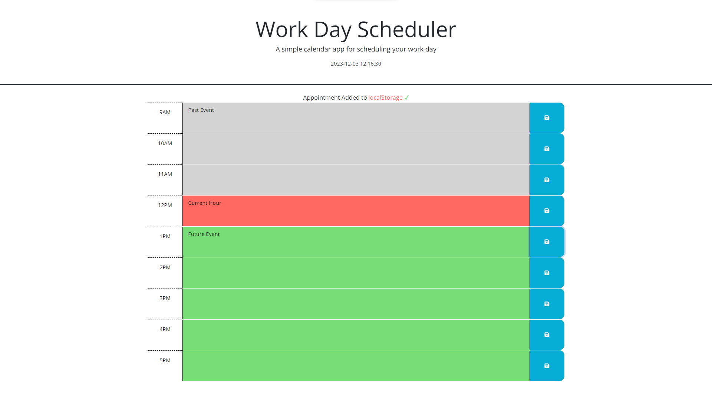

# Project title: Work Day Scheduler

## Description

- My motivation on doing this project was to earn a new skill.

- I builded that project to apply what I've learned.

- I have created a Work Day Scheduler that displays the current date and time using day.js library. It includes time slots from 9 AM to 5 PM, where each slot changes colors dynamically (gray, red, or green) based on whether it's in the past, current, or future, respectively. Users can enter an event and save it by clicking a button. The entered events are saved in the browser's localStorage. If the user refreshes the page, the saved events will remain.

- I learned about day.js library, localStorage, event listeners, get elements by id and const.

## Installation

Download the files from the repository and install.

# Usage

Link to view: [Coding Quiz](https://mariamdawood.github.io/Work-Day-Scheduler/)

Screenshot of website:
